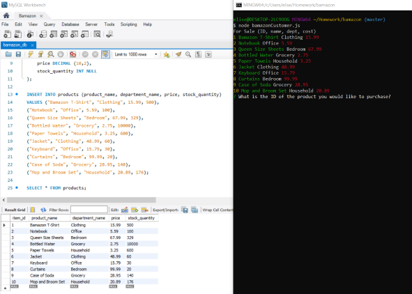
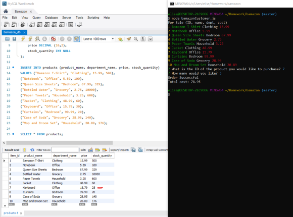
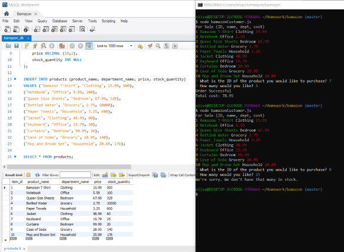

# bamazon
> This is an Amazon-like storefront command line node app that takes in orders from customers and deplete stock from the store's inventory.

## Table of contents
* [General info](#general-info)
* [Screenshots](#screenshots)
* [Technologies](#technologies)
* [Setup](#setup)
* [Features](#features)
* [Status](#status)
* [Inspiration](#inspiration)
* [Contact](#contact)

## General info
Using MySQL, a customer can chose an item for sale and a quantity. This will adjust the stock of the item as well as let the customer know how much it will cost.

## Screenshots

## Technologies
* MySQL
* JavaScript
* Nodejs

## Setup
npm install dotenv, mysql, inquirer and chalk  
A MySQL password and database will be needed.

## Code Examples
    for (i = 0; i < res.length; i++) {
        if (res[i].stock_quantity >= parseInt(answer.quantity)) {
            var query = "UPDATE products SET stock_quantity=? WHERE item_ID=?";
            // console.log(res);
            var cost = answer.quantity * res[i].price;
            // console.log(cost);
            var stock = res[i].stock_quantity - answer.quantity;
            // console.log(stock);
            connection.query(query, [stock, answer.product], function(err) {
                if (err) console.log(err);
                console.log("Order Successful\nTotal cost: " + cost.toFixed(2));
            });
        } else {
            console.log("We're sorry. We don't have that many in stock.");
        }
    }

## Features
List of features ready and TODOs for future development
* Running the program will provide a list of items available.
* Customer prompted to chose an item and a quantity.
* If there is enough stock, the order will be complete and the total cost will be shown. The items are also deducted from current stock.

## Status
Project is: _finished_

## Inspiration
Based on a homework assignment for The Coding Bootcamp at UT Austin

## Contact
Created by Elise Hammons - feel free to contact me!
 LinkedIn: https://www.linkedin.com/in/elise-h-01243258/